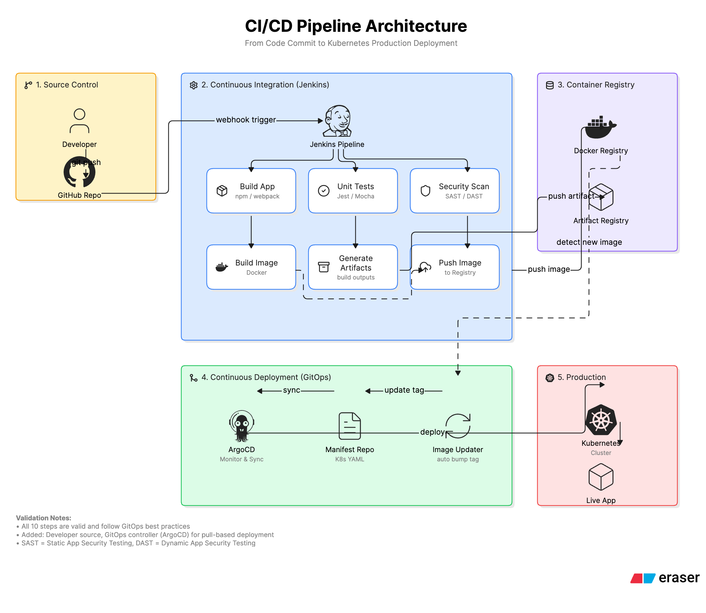

# CI/CD Pipeline Architecture Explanation
## Overview
This document explains a comprehensive CI/CD (Continuous Integration/Continuous Deployment) pipeline architecture that automates the journey from code commit to production deployment on Kubernetes. The architecture follows GitOps best practices and implements a pull-based deployment model using ArgoCD.

---

## Architecture Design


## Architecture Components
### 1. Source Control (Developer Workflow)
**Components:**

- Developer workstation
- GitHub Repository
**Flow:**
The pipeline begins when a developer commits and pushes code changes to the GitHub repository. This is the entry point for all changes that will eventually reach production.

**Key Action:** `git push` triggers the entire pipeline through a webhook mechanism.

---

### 2. Continuous Integration (Jenkins Pipeline)
**Components:**

- Jenkins CI Server
- Build, Test, and Security stages
**Pipeline Stages:**

| Stage | Tool | Purpose |
| ----- | ----- | ----- |
| **Build App** | npm / webpack | Compiles and bundles the JavaScript application |
| **Unit Tests** | Jest / Mocha | Validates code functionality through automated tests |
| **Security Scan** | SAST / DAST | Identifies vulnerabilities in code and running application |
| **Build Image** | Docker | Creates containerized application image |
| **Generate Artifacts** | Build outputs | Produces deployable artifacts |
| **Push Image** | Docker CLI | Uploads container image to registry |
**Trigger Mechanism:** GitHub webhook automatically triggers the Jenkins pipeline upon code push, ensuring immediate feedback on code changes.

**Security Testing Types:**

- **SAST (Static Application Security Testing):** Analyzes source code for vulnerabilities without executing the program
- **DAST (Dynamic Application Security Testing):** Tests the running application for security issues
---

### 3. Container Registry
**Components:**

- Docker Registry (for container images)
- Artifact Registry (for build artifacts)
**Purpose:**

- Stores versioned container images with unique tags
- Maintains build artifacts for traceability and rollback capabilities
- Serves as the source of truth for deployable assets
---

### 4. Continuous Deployment (GitOps with ArgoCD)
**Components:**

- ArgoCD (GitOps controller)
- Manifest Repository (Kubernetes YAML configurations)
- Image Updater
**GitOps Workflow:**

1. **Image Updater** detects new images in the Docker Registry
2. **Image Updater** automatically updates the image tag in the Manifest Repository
3. **ArgoCD** monitors the Manifest Repository for changes
4. **ArgoCD** synchronizes the desired state with the Kubernetes cluster
**Why GitOps?**

- **Declarative:** Infrastructure and application state defined in Git
- **Auditable:** All changes tracked through Git history
- **Automated:** Pull-based deployment eliminates manual intervention
- **Self-healing:** ArgoCD continuously reconciles actual vs. desired state
---

### 5. Production Environment (Kubernetes)
**Components:**

- Kubernetes Cluster
- Live Application
**Deployment Process:**
ArgoCD applies the Kubernetes manifests to the cluster, creating or updating:

- Deployments
- Services
- ConfigMaps
- Secrets
- Other Kubernetes resources
---

## End-to-End Flow Summary
```
Developer → GitHub → Jenkins → Docker Registry → ArgoCD → Kubernetes
              ↓                        ↓              ↓
           Webhook              Artifact Registry   Manifest Repo
```
**Step-by-Step:**

1. Developer pushes code to GitHub
2. GitHub webhook triggers Jenkins pipeline
3. Jenkins executes parallel stages:
    - Builds the application
    - Runs unit tests
    - Performs security scans

4. Jenkins builds Docker image
5. Docker image pushed to Container Registry
6. Build artifacts pushed to Artifact Registry
7. Image Updater detects new image and updates Manifest Repository
8. ArgoCD detects manifest changes and syncs with Kubernetes
9. Kubernetes deploys updated application to production
10. Live application serves end users
---

## Key Architecture Benefits
| Benefit | Description |
| ----- | ----- |
| **Automation** | Zero manual intervention from commit to deployment |
| **Security** | Integrated SAST/DAST scanning before deployment |
| **Traceability** | Complete audit trail through Git and artifact versioning |
| **Reliability** | Automated testing prevents broken code from reaching production |
| **Scalability** | Kubernetes handles application scaling automatically |
| **Recovery** | Easy rollback through Git revert or ArgoCD sync |
---

## Validation Notes
All 10 pipeline steps are valid and follow industry best practices:

- Code commit to GitHub repository
- GitHub webhook integration with Jenkins
- Jenkins pipeline trigger
- Application build using npm/webpack
- Unit testing with Jest/Mocha
- Security scanning (SAST/DAST)
- Docker image build
- Image push to Docker Registry
- Artifact generation and storage
- GitOps-based Kubernetes deployment via ArgoCD
